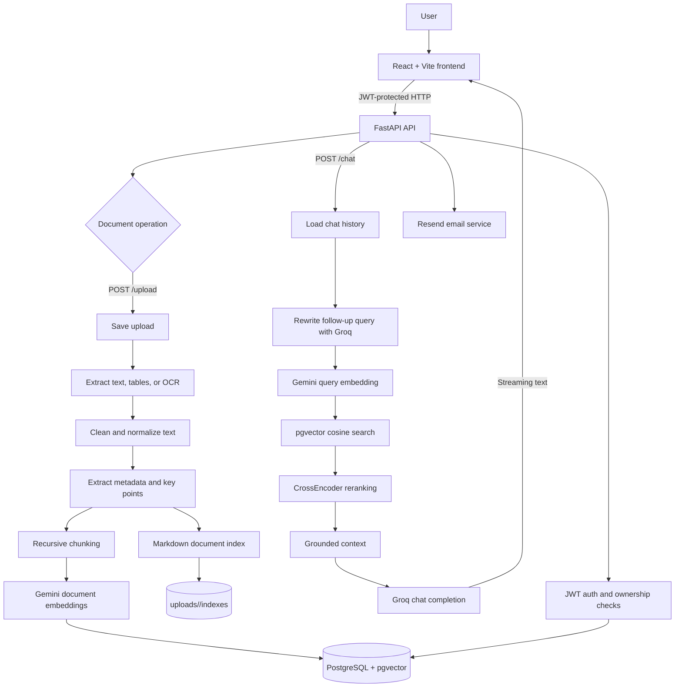

# RAG Studio

RAG Studio is a document intelligence workspace for uploading business documents, indexing their contents, and asking grounded questions against the indexed material. It combines a React dashboard with a FastAPI backend, PostgreSQL/pgvector storage, Gemini embeddings, CrossEncoder reranking, and Groq-powered answer generation.

## Technology Stack

| Layer               | Technology                                                                 | Purpose                                                                                             |
| ------------------- | -------------------------------------------------------------------------- | --------------------------------------------------------------------------------------------------- |
| Frontend            | React, Vite, Tailwind CSS, Lucide React                                    | Landing page, authentication, dashboard, uploads, retrieval diagnostics, and streaming chat UI      |
| API                 | FastAPI, Uvicorn, Pydantic                                                 | HTTP API, authentication dependencies, upload handling, chat streaming, and static frontend hosting |
| Database            | PostgreSQL, SQLAlchemy, pgvector                                           | Users, documents, chunks, embeddings, chat sessions, messages, and ownership relationships          |
| Document processing | pdfplumber, pypdf, python-docx, openpyxl, python-pptx, BeautifulSoup, lxml | Text, table, spreadsheet, presentation, HTML, and structured-data extraction                        |
| OCR                 | Tesseract, pytesseract, Pillow, pdf2image                                  | OCR fallback for scanned PDFs and images                                                            |
| Chunking            | LangChain RecursiveCharacterTextSplitter                                   | Recursive paragraph-aware chunking with overlap                                                     |
| Embeddings          | Google Gemini `gemini-embedding-001`                                       | 768-dimensional document and query vectors                                                          |
| Reranking           | Sentence Transformers CrossEncoder                                         | Reorders vector candidates by query relevance                                                       |
| Generation          | Groq `llama-3.3-70b-versatile`                                             | Streams grounded answers from retrieved context                                                     |
| Authentication      | bcrypt, Passlib, JWT via python-jose                                       | Password hashing, bearer tokens, email verification, and password reset                             |
| Email               | Resend                                                                     | Verification and password-reset email delivery                                                      |
| Deployment          | Docker, Docker Compose                                                     | Multi-stage frontend build and unified FastAPI runtime                                              |

## System Pipeline



## End-to-End Data Flow

### 1. Authentication

1. The frontend sends signup or login requests to `/auth/*`.
2. Signup stores a bcrypt password hash and sends an email verification link through Resend.
3. Login validates the password and verification state, then returns a JWT.
4. The frontend stores the token in `localStorage["rag_token"]`.
5. The API helper adds `Authorization: Bearer <token>` to protected requests.
6. Every document and chat operation checks ownership through the authenticated user and the `user_documents` association table.

Relevant code: `backend/auth.py`, `backend/dependencies.py`, `backend/routers/auth_router.py`, `frontend/src/components/AuthPage.jsx`.

### 2. Upload and ingestion

Single-file flow:

```text
POST /upload
  -> save under uploads/<user_id>/
  -> extract_file_text
  -> clean_text
  -> extract_document_metadata
  -> chunk_text
  -> embed_chunks
  -> embed_key_points
  -> save Document and DocumentChunk rows
  -> link document to user
```

Supported sources include PDF, DOCX, TXT, Markdown, JSON, CSV, XLSX, PPTX, HTML, and images.

- PDFs use `pdfplumber` for native text and tables.
- Scanned or nearly empty PDFs fall back to Tesseract OCR through `pdf2image`.
- Images use Tesseract OCR and retain basic image metadata.
- DOCX, spreadsheets, presentations, HTML, JSON, and CSV files use format-specific extractors.
- Cleaning normalizes line endings, whitespace, blank lines, and unsupported characters.
- ZIP uploads are recursively scanned and ingested as one logical bundle document, with relative filenames preserved as markers in the combined content.

Relevant code: `backend/routers/upload_router.py`, `backend/ingestion.py`, `backend/extract.py`, `backend/cleaning.py`.

### 3. Metadata, chunking, and indexing

After extraction:

1. Metadata is created, including title, source, file type, file size, upload time, key points, and an index document.
2. Key points are generated by the summarization helper.
3. Text is split with LangChain's `RecursiveCharacterTextSplitter`.
4. Default chunk size is `1000` characters with `50` characters of overlap.
5. Chunks are embedded with Gemini using the `RETRIEVAL_DOCUMENT` task type.
6. Embeddings are stored in PostgreSQL vector columns with dimension `768`.
7. A Markdown index is also written below `uploads/<user_id>/indexes/` and stored in the document record.

Relevant code: `backend/chunking.py`, `backend/metadata.py`, `backend/summarize.py`, `backend/embeddings.py`.

### 4. Retrieval and answer generation

Standard question flow:

```text
User question
  -> recent chat history
  -> Groq query rewriting
  -> Gemini RETRIEVAL_QUERY embedding
  -> pgvector cosine-distance candidates
  -> CrossEncoder reranking
  -> relevance filtering
  -> grounded prompt
  -> Groq streaming completion
  -> save assistant message
  -> stream answer to React
```

Retrieval details:

- Up to 10 vector candidates are selected.
- Candidates are reranked with `cross-encoder`.
- The top 5 reranked chunks are retained when they pass the relevance threshold.
- If the local reranker is unavailable, vector similarity order is used as a fallback.
- Broad overview questions can use representative chunks from the selected document instead of normal vector search.
- Retrieval diagnostics are available through `POST /retrieval/inspect`.

The chat endpoint saves the user message, loads history, rewrites the query, retrieves context, calls Groq, streams plain text, and saves the assistant response. The response includes `X-RAG-Status`, `X-RAG-Context-Chunks`, and `X-RAG-Reason` headers.

Relevant code: `backend/retrieval.py`, `backend/history.py`, `backend/routers/retrieval_router.py`, `backend/routers/chats_router.py`.

## Application Structure

```text
.
├── backend/
│   ├── main.py                 # FastAPI app and startup configuration
│   ├── routers/                # Auth, upload, document, chat, and retrieval endpoints
│   ├── models/                 # SQLAlchemy models and user/document association
│   ├── ingestion.py            # Upload-to-index orchestration
│   ├── extract.py              # File extraction and OCR
│   ├── retrieval.py            # Query rewriting, vector search, and reranking
│   ├── embeddings.py           # Gemini embedding integration
│   └── database.py             # SQLAlchemy engine and sessions
├── frontend/
│   ├── src/App.jsx             # Screen state, API helper, and dashboard
│   ├── src/components/         # Landing, auth, theme, and UI components
│   └── src/styles.css          # Global styles and Tailwind setup
├── Dockerfile                  # Multi-stage frontend and backend image
├── docker-compose.yml           # Production app service
└── requirements.txt             # Python dependencies
```

## API Surface

| Area           | Endpoints                                                                                                                                         |
| -------------- | ------------------------------------------------------------------------------------------------------------------------------------------------- |
| Authentication | `POST /auth/signup`, `GET /auth/verify-email`, `POST /auth/login`, `POST /auth/forgot-password`, `POST /auth/reset-password`, `POST /auth/logout` |
| Uploads        | `POST /upload`                                                                                                                                    |
| Documents      | `GET /documents`, `DELETE /documents/{id}`, `GET /documents/{id}/chunks`, `GET /documents/{id}/metadata`, `GET /documents/{id}/embeddings`        |
| Chats          | `GET /chats`, `POST /chat/new`, `GET /chat/{id}/history`, `DELETE /chat/{id}`, `DELETE /chats`, `POST /chat`                                      |
| Retrieval      | `POST /retrieval/inspect`                                                                                                                         |

## Database Model

- `users`: credentials, verification state, and reset-token state.
- `documents`: document content, metadata, key points, and key-point embedding.
- `document_chunks`: chunk text, chunk order, and 768-dimensional embedding.
- `user_documents`: many-to-many ownership association between users and documents.
- `chats`: user-owned chat sessions.
- `messages`: ordered user and assistant messages belonging to a chat.

The application creates tables at startup and performs a lightweight check for document columns. PostgreSQL and the pgvector extension are external dependencies; they are not provisioned by `docker-compose.yml`.

## Local Development

### Backend

```powershell
cd backend
python -m venv .venv
.\.venv\Scripts\Activate.ps1
pip install -r ..\requirements.txt
uvicorn main:app --reload
```

### Frontend

```powershell
cd frontend
npm ci
npm run dev
```

Vite runs on port `5173` and proxies API requests to `http://localhost:8000`. The frontend uses `VITE_API_URL` when set; otherwise it uses relative API paths.

### Environment configuration

The backend reads environment variables from `backend/.env`. The deployment needs values for the database, JWT signing, Gemini, Groq, and email integration. Common settings include:

```env
DATABASE_URL=postgresql+psycopg://...
SECRET_KEY=...
GEMINI_API_KEY=...
GROQ_API_KEY=...
GROQ_CHAT_MODEL=llama-3.3-70b-versatile
RESEND_API_KEY=...
FROM_EMAIL=...
BACKEND_URL=http://localhost:8000
FRONTEND_URL=http://localhost:5173
CORS_ORIGINS=http://localhost:5173
```

Do not commit real credentials or tokens.

## Docker Deployment

The Dockerfile builds the frontend first, then copies the compiled assets into a Python 3.12 runtime image.

```powershell
docker compose up --build
```

The service maps host port `80` to container port `8000`. FastAPI serves both the API and the built React application. The image includes Tesseract, Poppler, PostgreSQL client libraries, and CPU-only PyTorch.

`docker-compose.yml` does not include a PostgreSQL service or a persistent volume for `/app/uploads`. Provide PostgreSQL/pgvector externally and configure persistent storage for uploads and generated indexes in production.

## Tests and Checks

Focused OCR and metadata tests:

```powershell
cd backend
pytest test_ocr_fallback.py test_document_index_metadata.py test_bundle_upload_metadata.py
```

Manual database-backed checks:

```powershell
cd backend
python test_ingestion.py
python test_retrieval.py
```

The manual checks require a configured database, an existing test user, and indexed documents. Running every file named `test_*.py` together may execute these database-backed scripts as imports, so prefer the focused command above.

## Current Implementation Notes

- ZIP bundles are currently stored as one logical document, not one database document per file.
- Chat output is streamed as `text/plain`; it is not Server-Sent Events.
- The local CrossEncoder and the Gemini/Groq services are optional at runtime only where fallback behavior is implemented; production quality depends on the configured services being available.
- Upload files and generated indexes are container-local unless persistent storage is configured.
- There is no Alembic migration setup; schema changes are handled through startup table creation and a lightweight document-column check.
